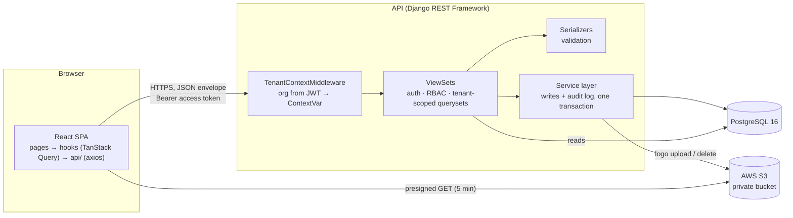
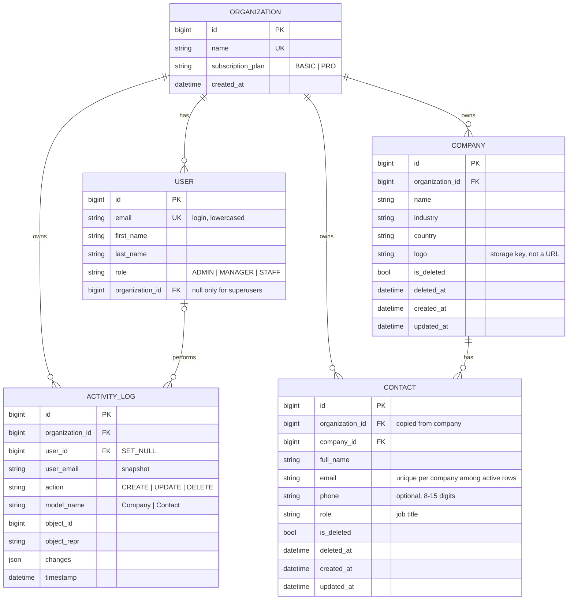
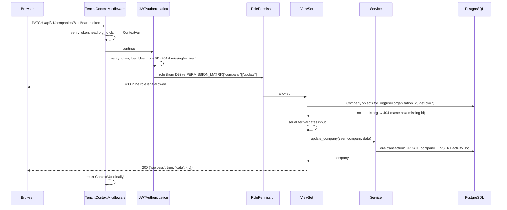
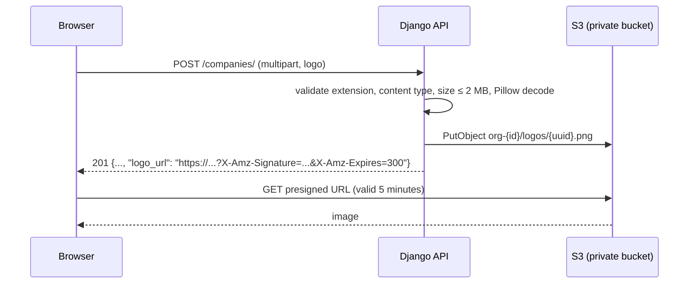
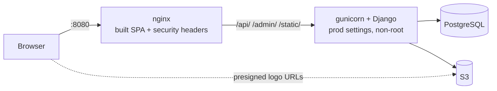

# Architecture

How the CRM is put together, and where each rule is enforced. File paths are relative to the
repository root. For the reasoning behind individual choices, see [DECISIONS.md](DECISIONS.md).

## 1. Components



| Layer | Where | Responsibility |
|---|---|---|
| Pages | `frontend/src/pages/` | Compose features; own no server state |
| Hooks | `frontend/src/hooks/` | TanStack Query queries and mutations, cache invalidation |
| API client | `frontend/src/api/` | The only code that knows URLs and axios; unwraps the envelope; token refresh |
| Middleware | `backend/apps/core/middleware.py` | Sets the current organization for the request |
| Views | `backend/apps/*/views.py` | Thin: validate → call service → serialize |
| Permissions | `backend/apps/core/permissions.py`, `apps/organizations/roles.py` | Role matrix, deny by default |
| Serializers | `backend/apps/*/serializers.py` | Input validation, tenant-scoped related fields, output shape |
| Services | `backend/apps/crm/services.py`, `apps/activity/services.py` | Every write + its audit row, atomically |
| Models / managers | `backend/apps/*/models.py`, `apps/core/managers.py` | Schema, constraints, org-scoped and soft-delete-aware querysets |

### Backend apps

| App | Contents |
|---|---|
| `core` | Cross-cutting building blocks: `TenantModel`, managers, middleware, permissions, base viewsets, pagination, response envelope, exception handler, validators, health check |
| `organizations` | `Organization`, custom `User` (email login), roles and the permission matrix, auth endpoints, `seed_demo` |
| `crm` | `Company`, `Contact`, their services, serializers, filters and viewsets |
| `activity` | `ActivityLog` (append-only), logging helpers, read-only API |
| `dashboard` | `GET /dashboard/stats/` |

## 2. Data model



Constraints worth knowing:

- **`User`:** a database check constraint requires `organization IS NOT NULL OR is_superuser`, so
  every API user belongs to a tenant.
- **`Contact` email uniqueness:** a *partial* unique index on `(company, email) WHERE is_deleted =
  false`. A soft-deleted contact doesn't block reusing its email.
- **`Contact.organization` must equal its company's organization.** The service sets it from the
  company, and `Contact.save()` refuses a mismatch.
- **Indexes** match the common queries: `(organization, is_deleted, name)` on companies,
  `(organization, company, is_deleted)` on contacts, and `(organization, -timestamp)` and
  `(organization, model_name, object_id)` on the activity log.

## 3. A request, end to end



Every response uses one envelope, produced by `core/renderers.py`, `core/pagination.py` and
`core/exceptions.py`:

```json
{ "success": true,  "message": "", "data": { }, "meta": { "count": 13, "page": 1, "page_size": 10, "total_pages": 2 } }
{ "success": false, "message": "Validation failed.", "code": "validation_error", "errors": { "email": ["..."] } }
```

Error codes: `validation_error` (400), `not_authenticated` (401), `permission_denied` (403),
`not_found` (404), `conflict` (409, a unique constraint lost a race), `throttled` (429),
`server_error` (500, generic message, details only in the server log).

## 4. Tenant isolation: four layers

| # | Layer | Code | What it guarantees |
|---|---|---|---|
| 1 | Schema | `core/models.py` `TenantModel` | Every tenant row has a non-null `organization` FK |
| 2 | Query (primary control) | `core/viewsets.py` `get_queryset()` → `for_org(user.organization_id)` | Lists and `get_object()` only see the user's org; another org's id is a 404 |
| 3 | Manager (ambient) | `core/managers.py` `TenantManager` | Also filters by the org in the ContextVar and hides soft-deleted rows |
| 4 | Middleware | `core/middleware.py` | Sets that ContextVar from the signed JWT's `org_id`, and always resets it |

Supporting rules:

- **Related objects are scoped too.** `ContactSerializer.company` only accepts companies from the
  user's org (`TenantCompanyField`). A foreign company id is rejected as "Company not found.", so
  a record can't be attached to another tenant's data.
- **`IsSameOrganization`** re-checks `obj.organization_id` at object level, as a backstop.
- **The audit writer refuses cross-org entries** (`activity/services.py`).

Why it's built this way:

- **Why the middleware decodes the JWT itself:** DRF authenticates inside the view, so a
  middleware can't see `request.user` yet. It verifies the token's signature and expiry but
  never rejects a request; DRF still decides 401s.
- **Fail-safe when layers disagree:** layers 2 and 3 are AND-ed. If a token's `org_id` ever
  differed from the user's current organization, queries return nothing rather than the wrong
  tenant's data. `test_stale_org_claim_in_token_fails_safe` proves this.
- **Why layer 2 is mandatory:** layer 3 is fail-open when no org is set (Django shell,
  migrations, management commands, admin). Every view therefore filters explicitly, and the
  ambient filter is defense in depth.
- **Next step for production:** PostgreSQL Row-Level Security, which would enforce the same rule
  inside the database.
- **Why 404 and not 403** for another tenant's id: a 403 would confirm the id exists elsewhere.

## 5. Role-based access control

`apps/organizations/roles.py` holds the single source of truth:

| Resource | Action | Admin | Manager | Staff |
|---|---|:-:|:-:|:-:|
| Company | list / retrieve | ✓ | ✓ | ✓ |
| Company | create / update | ✓ | ✓ | ✗ |
| Company | delete | ✓ | ✗ | ✗ |
| Contact | list / retrieve / create | ✓ | ✓ | ✓ |
| Contact | update | ✓ | ✓ | ✗ |
| Contact | delete | ✓ | ✗ | ✗ |
| Activity log | list / retrieve | ✓ | ✓ | ✗ |
| Dashboard | read | ✓ | ✓ | ✓ (no recent activity) |

How it's enforced:

- **Server side:** `RolePermission` maps the DRF action to a verb (`ACTION_TO_VERB`) and checks
  `user.role` against the matrix. Unknown actions or resources are denied.
- **Role source:** the role comes from the **database** user, not the token claim, so a role
  change applies on the next request.
- **UI side:** `GET /auth/me/` returns the same matrix as `capabilities`. The UI's
  `can(resource, verb)` and `<RoleGate>` hide buttons with it, and the Activity route shows a
  Forbidden page. This is convenience only; the API is the control.
- **Tests:** `tests/test_rbac.py` checks every cell of the table against the live API.

## 6. Writes, audit log and soft delete

All Company and Contact writes go through `apps/crm/services.py`. Each function is
`@transaction.atomic`: it makes the change and then writes the `ActivityLog` row. If logging
fails, the change rolls back, so no write can go unaudited.

| Operation | Log rows | `changes` |
|---|---|---|
| Create | 1 × `CREATE` | Snapshot `{field: {"new": v}}` |
| Update | 1 × `UPDATE` | Only changed fields, `{field: {"old": a, "new": b}}` |
| Delete company | 1 × `DELETE` + 1 × `DELETE` per active contact (bulk insert) | `{}` |
| Delete contact | 1 × `DELETE` | `{}` |

Rules:

- **Why services and not signals:** signals can't know which user acted.
- **The org always comes from the server:** `organization` is taken from the acting user (or
  from the company, for contacts), never from client input.
- **Logos appear in the log as storage keys, never as (signed) URLs.**
- **Delete is a soft delete:** it sets `is_deleted` and `deleted_at`.
  - The default manager hides deleted rows everywhere, including serializer uniqueness checks.
  - `QuerySet.update()` skips `auto_now`, so the cascade sets `updated_at` explicitly.
- **Contacts can't move between companies:** a contact's `company` can't change after creation.
- **The log is append-only:**
  - `ActivityLog.save()` refuses updates.
  - The API is read-only.
  - The Django admin registration is read-only.

## 7. File storage (company logos)



- **The bucket is private** (Block Public Access on). The API stores only the object key; every
  response carries a fresh presigned GET URL that expires after 5 minutes.
- **Keys are namespaced per tenant** (`org-{id}/logos/…`), and the IAM policy is scoped to that
  prefix.
- **Allowed types:** JPEG, PNG and WebP. SVG is rejected because it can carry scripts.
- **Replacing or removing a logo** deletes the old object in `transaction.on_commit`, so a
  rolled-back update never loses a file. Soft delete keeps the file, because the record still
  exists.
- **Local fallback:** with `USE_S3=False`, the same code stores files in `backend/media/`
  (Django's `FileSystemStorage`). Tests always use local storage.
- **Credentials:** they come only from the environment. With empty keys, boto3 uses its default
  chain, so an EC2 or ECS IAM role works without keys.

Step-by-step bucket and IAM setup: [AWS_S3_SETUP.md](AWS_S3_SETUP.md).

## 8. Authentication

| Endpoint | Purpose |
|---|---|
| `POST /auth/login/` | Email + password → `{access, refresh, user}`. Throttled to 10/min per client IP; one generic error message, so it doesn't reveal which emails exist |
| `POST /auth/refresh/` | Rotates: returns a new refresh token and blacklists the old one |
| `POST /auth/logout/` | Blacklists the given refresh token (only the caller's own) |
| `GET /auth/me/` | User, organization, capabilities |

Tokens and the frontend session:

- **Claims:** `user_id`, `org_id`, `role`, `email`.
- **Lifetimes:** access tokens last 15 minutes and refresh tokens 7 days; both are set by
  environment variables.
- **Blocked users:** inactive users and users without an organization get 403 at login.
- **Where the frontend keeps tokens:** the access token only in memory, the refresh token in
  `localStorage`.
- **Restoring a session:** on load, `AuthContext` calls refresh and then `/auth/me/`.
- **Expired access tokens:** the axios interceptor refreshes once for all parallel 401s (a
  single shared promise) and retries them. If the refresh fails, the user is signed out and sent
  to `/login`.

## 9. Frontend structure

```
frontend/src/
├── api/         client.ts (axios + interceptors), tokenStore, errors (ApiError), types, one *.api.ts per resource
├── context/     AuthContext: user, status, login/logout, can(resource, verb)
├── hooks/       useCompanies, useContacts, useActivityLogs, useDashboard, useListParams, queryKeys
├── components/  ui/ (shadcn primitives), common/ (Modal, ConfirmDialog, FormField, ErrorBanner, EmptyState…),
│                data/ (DataTable, Pagination, SearchInput, FilterSelect, RowActions), layout/, auth/ (ProtectedRoute, RoleGate)
├── features/    companies/, contacts/, activity/ (forms and pieces used by more than one page)
├── pages/       Login, Dashboard, Companies, CompanyDetail, ActivityLog, NotFound, Forbidden
└── router.tsx   routes; pages behind login are lazy-loaded
```

State and rules:

- **Server state** lives in TanStack Query. After a write, the relevant keys are invalidated
  (`hooks/queryKeys.ts`). A contact change, for example, refreshes contacts, companies (for the
  count), the activity log and the dashboard.
- **List state lives in the URL** (`useListParams`): page, search, filters, ordering. Reload,
  back and shared links work, and any filter change resets to page 1. Search is debounced by
  400 ms.
- **Forms** use react-hook-form + zod. The client-side rules mirror the server's for fast
  feedback. Server field errors (for example a duplicate email) are mapped back onto the right
  field.

## 10. Deployment shape



`docker-compose.prod.yml` runs this locally:

- **One origin:** nginx serves the SPA and proxies the API, so no CORS is needed (D-017).
- **Backend isolation:** the backend has no published port, and `TRUSTED_PROXY_COUNT=1` makes
  rate limiting use the client IP that nginx saw.
- **Rate-limit counters** live in a shared database cache, so all gunicorn workers count
  together (D-018).
- **Real deployment:** TLS terminates at a load balancer. Keep `DJANGO_SECURE_SSL_REDIRECT=True`
  and raise `TRUSTED_PROXY_COUNT` by one for the load balancer.
